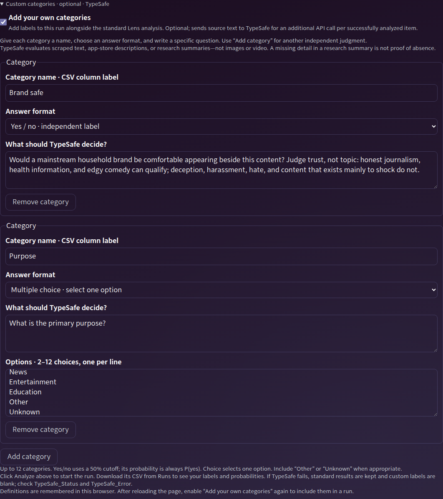

# Lens

Lens classifies advertising inventory — websites, iOS apps, Android apps and
CTV channels — into quality tiers with IAB content categories, using an
escalating crawl ladder and LLM classification. Hand it a mixed list of
identifiers; it works out what each one is, gathers what it can, and returns a
structured CSV.


> **You need an OpenRouter API key.** Every classification is an LLM call, so
> runs cost real money — a large list against a frontier model gets expensive.
> Get a key at [openrouter.ai/keys](https://openrouter.ai/keys) and start
> small.

---

## Features

- **One list, four content types.** Websites, iOS App Store IDs, Android
  package names and CTV bundle IDs are detected per row from a single input
  file — no mode to pick, no pre-sorting. Mixed lists are the normal case.
- **An escalating crawl ladder.** Sites that resist a plain HTTP fetch are
  retried with progressively heavier machinery, and sites that block every
  crawler are still classified rather than dropped. [Details below.](#how-it-works)
- **Bot-protection detection as a signal, not just a failure.** Each website
  row records what actually happened to the crawl — `None Detected`,
  `Moderate`, `Aggressive`, `Unknown` — derived from observed behaviour, never
  guessed by the model. Sites that filter bots tend to carry less invalid
  traffic, so stronger protection is a *positive* buying signal.
- **CTV without a page to crawl.** Connected-TV apps have no scrapeable
  website, so they run a two-step pipeline: research the app with a web-search
  model, then classify that research. Platform (Roku, Fire TV, Android TV,
  Apple TV, Vizio, Samsung, Xbox) is inferred from the bundle-ID shape.
- **Store metadata for apps.** iOS goes through the iTunes Search API, Android
  through the Play Store, both deliberately rate-limited. App name, developer,
  category, rating and downloads come back alongside the classification.
- **Resumable by construction.** Progress is written after *every* item. Kill
  a run mid-flight, restart it, and it picks up where it stopped.
- **Rich output.** Quality tier, justification, IAB tiers 1–3, description,
  language, political leaning, audience size, bot protection, content length,
  which rung of the ladder produced the data, and a timestamp.
- **Your own categories.** Optional TypeSafe yes/no labels or multiple-choice
  categories alongside standard results, with raw probabilities.
  [Setup and examples](docs/CUSTOM_CATEGORIES.md).
- **A web dashboard, or just the CLI.** The FastAPI dashboard adds uploads, a
  one-at-a-time job queue, live progress and artifact downloads. The CLI needs
  nothing but Python and a key.

## How it works

Input rows are classified by shape — numeric ID → iOS, reverse-DNS package →
Android, domain → website, CTV columns → CTV — and routed to the right
pipeline. Websites then climb a ladder, stopping at the first rung that
returns usable content:

```
  ┌─────────────────────────────────────────────────────────────────┐
  │ 1. direct     plain async HTTP fetch, no JavaScript             │
  │               fast, cheap, handles most of the list             │
  └───────────────────────────┬─────────────────────────────────────┘
                              │ too short, error, or challenge page
  ┌───────────────────────────▼─────────────────────────────────────┐
  │ 2. firecrawl  self-hosted Firecrawl → headless Chromium via     │
  │               Playwright, returns clean markdown; concurrent    │
  │               (skipped when the stack isn't running)            │
  └───────────────────────────┬─────────────────────────────────────┘
                              │ still failing — and NOT an anti-bot block
  ┌───────────────────────────▼─────────────────────────────────────┐
  │ 3. deep       Selenium headless Chrome in a Podman container    │
  │               single-session, slow, last resort for rendering   │
  └───────────────────────────┬─────────────────────────────────────┘
                              │ nothing could fetch the page
  ┌───────────────────────────▼─────────────────────────────────────┐
  │ 4. research   a web-search model researches the domain and      │
  │               classification runs on that summary.              │
  │               The site is never contacted from your IP.         │
  └─────────────────────────────────────────────────────────────────┘

  Each row records the rung that produced it in Scrape_Mode. Domains the
  research model finds nothing about stay Failed rather than being guessed at.
```

Two design decisions are worth calling out, because they look like missing
features until you know why:

**The ladder deliberately gives up fast on hardened sites.** Publishers behind
Cloudflare, DataDome or PerimeterX reject datacenter IPs outright. Retrying
harder does not get in — it converts a soft block into a permanent ban. So an
anti-bot verdict is treated as final: it is not retried, and it skips the deep
rung entirely (which renders from the same IP and would fail identically).
Those domains go straight to research. To actually crawl them, route
Firecrawl's browser through a residential proxy.

**Every rung is optional.** Auto mode probes each one at runtime and skips what
isn't installed. On a bare machine with no Podman, Lens is a direct crawler
plus a research fallback, and it says so in `Scrape_Mode` rather than failing.

Classification itself is a tool-calling request against OpenRouter with the IAB
taxonomy as the permitted vocabulary. Truncated responses are retried, never
written out as a plausible-looking guess.

## Quick start

### Install the dashboard on a server

On a Fedora server with curl and root/sudo access, install directly from this
public repository — no GitHub account or deploy key needed:

```bash
curl -fsSL https://raw.githubusercontent.com/ElcanoTek/lens/main/install.sh | sudo bash
```

The installer asks for your OpenRouter key, auth configuration and an optional
TLS hostname. It installs the service, Python runtime and browser containers.
Then manage everything with:

```bash
lens doctor                     # diagnose configuration, service and runtime
lens update --yes               # deploy main; restore previous release on failure
lens host check                 # available OS/package updates
lens host update --yes          # update all packages in enabled DNF repositories
lens host upgrade --dry-run     # plan the latest stable Fedora upgrade
```

See the [deployment guide](docs/DEPLOYMENT.md) for unattended installs, JSON
diagnostics, optional Node/npm/Go tooling and the Fedora upgrade workflow.

### Run the CLI locally

The CLI is the low-friction path — no service, no auth, no containers.

```bash
git clone https://github.com/ElcanoTek/lens.git
cd lens
python3 -m venv .venv && source .venv/bin/activate
pip install -r requirements.txt

cp .env.example .env          # then put your OpenRouter key in it
```

Point it at a list. The bundled fixtures are synthetic and safe to burn a few
cents on:

```bash
python main.py --input-csv test-input/url_master.csv \
               --output-csv output.csv \
               --scrape-mode direct
```

Or use your own file. Any of `pageURL`, `Domain`, `domain`, `url`, `URL`,
`app_id`, `package`, `package_name` and friends is auto-detected as the
identifier column:

```csv
pageURL
example.com
com.spotify.music
333903271
```

```bash
python main.py --input-csv my-list.csv     # auto mode: full ladder
```

Results land in `output.csv`, resumable state in `progress.json`, and a
detailed log in `site_analysis.log`. Re-running skips everything already
processed; delete `progress.json` and `output.csv` for a clean run.

CTV lists are auto-detected, or forced explicitly:

```bash
python main.py --input-csv test-input/CTV_Master.csv --ctv
```

### Useful flags

| Flag | Effect |
|---|---|
| `--scrape-mode auto\|direct\|deep\|firecrawl` | Pick a rung, or `auto` for the whole ladder (default) |
| `--deep-scrape` | Shorthand for `--scrape-mode deep` |
| `--ctv` | Force the CTV pipeline |
| `--llm-model MODEL` | Override the classification model for this run |
| `--research-model MODEL` | Override the research model (needs built-in web search) |
| `--research-fallback on\|off` | Toggle the research rung for this run |
| `--input-csv` / `--output-csv` / `--progress-file` / `--log-file` | Per-run paths |
| `--allow-redirects` | Follow off-host redirects instead of failing them |
| `--quiet` / `--verbose` | Less or more per-item output |
| `--jsonl PATH` | Structured per-attempt log |

Housekeeping lives in `manage.py`:

```bash
python manage.py setup          # scaffold .env and config.json
python manage.py validate       # check the key and input file are present
python manage.py progress       # progress summary
python manage.py stats          # detailed counters and failures
python manage.py reset          # delete progress.json (with confirmation)
python manage.py reset-failed   # re-queue only the failed items
python manage.py sample         # write sample_input.csv
```

### Output columns

| Column | Contents |
|---|---|
| `Domain` | The identifier: domain, App Store ID or package name |
| `Type` | `WEBSITE`, `IOS`, `ANDROID` or `CTV` |
| `App_Name`, `Developer`, `Store_Category`, `Rating`, `Rating_Count`, `Downloads` | Store metadata (blank for websites) |
| `Quality` | `Premium`, `Standard`, `Long Tail` or `Failed` |
| `Justification` | Why that tier |
| `IAB Tier 1/2/3` | IAB content taxonomy categories |
| `Description` | One-sentence summary |
| `Language` | Primary content language |
| `Political_Leaning` | Eight-point scale, or `Non-Political` |
| `Audience_Size` | `XS`–`XL` |
| `Bot_Protection` | Observed crawl resistance (websites only) |
| `Content_Length`, `Processing_Time` | Per-item metrics |
| `Scrape_Mode` | Which rung produced the data |
| `Classifier_Mode`, `Scraped_At` | Provenance |

CTV runs emit a wider set including `Bundle_ID`, `SSP`, `Publisher`,
`Platform`, `Network_Affiliation`, `Target_Audience` and `Research_Summary`.

## Optional custom categories

Add your own yes/no labels or multiple-choice categories alongside Lens's
standard analysis, powered by TypeSafe. Configure `TYPESAFE_API_KEY` on the server
and restart Lens; the editor appears only when a key is configured. Bootstrap
offers an optional key prompt; existing installs can use `sudo lens env edit`
and `sudo lens restart`.



### Quick dashboard guide

1. Upload and select your input file. Open **Custom categories** and check
   **Add your own categories**.
2. Enter a **category name**, which becomes a CSV column label. Choose **Yes / no**
   for an independent label, or **Multiple choice** for one answer from 2–12
   options (one option per line).
3. Write a specific question, and define what the label means so TypeSafe
   judges the idea rather than a list of topics. For example, name a label
   **Brand safe** and ask “Would a mainstream household brand be comfortable
   appearing beside this content? Judge trust, not topic: honest journalism,
   health information, and edgy comedy can qualify; deception, harassment, hate,
   and content that exists mainly to shock do not.” For a **Purpose** category,
   ask “What is the primary purpose?” and supply `News`, `Entertainment`,
   `Education`, `Other`, and `Unknown` as separate options.
4. Use **Add category** for more questions (up to 12), then click **Analyze**
   above the settings.
5. Download the CSV from **Runs**. Look for `Custom: <name>` and
   `P(yes/choice): <name>` columns. Yes/no uses a 50% cutoff and reports P(yes);
   multiple choice reports the probability of the selected option.

Definitions are remembered in your browser, but the feature switches off after
a page reload—enable it again for the next run. TypeSafe evaluates source text,
app-store descriptions, or research summaries, **not images or video**, and adds
an API call per successfully analyzed item. Missing research details are not
proof of absence. If TypeSafe fails, standard results remain available, custom
labels stay blank, and `TypeSafe_Status` / `TypeSafe_Error` explain the failure.

For CLI use, add `--custom-categories examples/custom-categories.json` to your
normal command. See [Custom categories](docs/CUSTOM_CATEGORIES.md) for the JSON
format, setup details, definition downloads, and resume behavior.

## Configuration

Three layers, later winning: **built-in defaults** → `config.json` →
**environment variables and CLI flags**.

Secrets and per-host settings go in `.env`
([`.env.example`](.env.example) documents every one):

| Variable | Required | Default | Purpose |
|---|---|---|---|
| `OPENROUTER_API_KEY` | **Yes** | — | Classification credential. Lens refuses to start without it. |
| `AUTH_SIGNING_PUBKEY` | Dashboard only | *(empty)* | Base64 Ed25519 **public** key used to verify the session cookie. Verify-only, so it cannot mint a session. |
| `AUTH_LOGIN_URL` | No | `https://auth.elcanotek.com` | Where unauthenticated browsers are sent |
| `AUTH_COOKIE_NAME` | No | `elcano_auth` | Session cookie to verify |
| `LENS_AUTH_MODE` | No | `elcano` | Keep legacy magic-link cookies or opt into central application handoff |
| `AUTH_ISSUER_URL` | Central mode | — | Exact central Auth origin |
| `LENS_PUBLIC_URL` | Central mode | — | Exact public Lens origin registered with Auth |
| `AUTH_CLIENT_ID` / `AUTH_CLIENT_SECRET` | Central mode | — | Confidential client credentials; the secret is stored only on this Lens host |
| `LENS_SESSION_SECRET` | Central mode | — | At least 32 random bytes for the short-lived login transaction cookie |
| `LENS_ACCESS_DB` | No | `/var/lib/lens/access.db` | Persistent local allowlist, hashed Lens sessions, and replay-safe logout events |
| `SCRAPER_VERBOSE` | No | *(unset)* | `1`/`true`/`yes`/`on` — same as `--verbose` |

Central mode keeps authorization local. After registering Lens in Auth, run
`auth app set-backchannel <client-id> https://lens.example.com/auth/backchannel-logout`,
then grant users with `lens access grant person@example.com`. Password changes,
central account disablement, and sign-out-everywhere revoke Lens sessions; the
legacy `elcano` magic-link mode remains the default and is unchanged.

Tuning goes in `config.json` (git-ignored; copy from
[`config.json.example`](config.json.example), which annotates all 64 keys).
The ones you are most likely to touch:

| Key | Default | Purpose |
|---|---|---|
| `scrape_mode` | `auto` | Which rung, or the whole ladder |
| `concurrent_sessions` | `5` | Website fetch concurrency |
| `llm_model` | `~google/gemini-flash-latest` | Classification model. `~vendor/…-latest` aliases auto-track the vendor's current model. |
| `llm_fallback_model` | `~openai/gpt-mini-latest` | Cross-provider fallback |
| `llm_max_tokens` | `1500` | Raise if classifications truncate |
| `min_content_length` | `500` | Shortest page body accepted as real content |
| `request_timeout` | `30` | Seconds per page fetch |
| `firecrawl_enabled` | `true` | Use the Firecrawl rung when it is running |
| `firecrawl_proxy` | `basic` | Leave it. `auto` re-hammers hardened sites for nothing. |
| `research_fallback_enabled` | `true` | Classify blocked sites from public research |
| `research_model` | `perplexity/sonar-pro` | Needs built-in web search |
| `ios_request_delay` / `android_request_delay` | `5.0` / `10.0` | Store politeness. Lowering these gets you blocked. |

Full reference: [`docs/DEPLOYMENT.md`](docs/DEPLOYMENT.md#configuration-reference).

## The web dashboard

A FastAPI app (`web_service.py`) for teams that would rather not share a
terminal:

- Drag-and-drop CSV/XLSX upload, with a detected content-type breakdown shown
  per file before you run anything.
- A queue that runs one job at a time and lets you cancel queued or running
  jobs.
- Live progress: a stacked bar of succeeded / queued-for-retry / failed, plus
  an ETA that models the retry passes separately from the fast pass.
- Per-run downloads of the output CSV, progress JSON and log.
- Optional per-job model overrides, populated live from OpenRouter's catalogue
  and price-capped — classification is high-volume and does not benefit from
  frontier-priced models.

```bash
export OPENROUTER_API_KEY=...
export AUTH_SIGNING_PUBKEY=...      # else every request redirects to login
uvicorn web_service:app --host 127.0.0.1 --port 8808
```

In legacy mode, authentication is a signed cookie verified against a public
key — Lens has no login or password of its own. Central mode exchanges Auth's
one-use code for a Lens-local session and keeps its application allowlist in
`/var/lib/lens/access.db`. Without `AUTH_SIGNING_PUBKEY` it fails closed.
Central configuration and the access database are validated during startup and
by the public `/health` readiness probe. Central logout revokes the Lens
session and then redirects to Auth's `/logout?client_id=lens`, which ends
every central session of the account and signs the user out of every
application; the browser lands on Auth's login page. Legacy logout continues
through the Elcano Auth service.

The dashboard shells out to `main.py` as a subprocess per job, so environment
variables and CLI flags are the only configuration surface — there is no
separate in-process code path to keep in sync.

## Deployment

Running Lens as a service on Fedora/RHEL is a single bootstrap script:

```bash
curl -fsSL https://raw.githubusercontent.com/ElcanoTek/lens/main/install.sh | sudo bash
```

It creates the `lens` system user and `/opt/lens`, builds a venv with `uv`,
installs the systemd units and a `lens` operator CLI, and optionally sets up
Caddy with automatic TLS. Updates are staged and health-checked, with automatic
code-and-venv rollback. `lens doctor` diagnoses the installation; `lens host`
handles package maintenance and Fedora upgrade preparation.

**[docs/DEPLOYMENT.md](docs/DEPLOYMENT.md) is the full guide** — prerequisites,
the `/opt/lens` layout, the complete environment and `config.json` reference,
the optional Firecrawl stack, TLS via Caddy or nginx, the operator CLI, the
update and rollback procedure, backups, health checks, and troubleshooting for
the failure modes you will actually hit.

## Documentation

| Document | What's in it |
|---|---|
| [`docs/DEPLOYMENT.md`](docs/DEPLOYMENT.md) | Production install, configuration reference, operations, troubleshooting |
| [`docs/LICENSING.md`](docs/LICENSING.md) | What BSL 1.1 lets you do, what "non-production" means, how the Change Date works |
| [`AGENTS.md`](AGENTS.md) | Architecture map, module responsibilities, and the non-obvious gotchas |
| [`CONTRIBUTING.md`](CONTRIBUTING.md) | Setup, tests, branch and PR conventions |
| [`SECURITY.md`](SECURITY.md) | Reporting a vulnerability; scope; secure operation |
| [`CODE_OF_CONDUCT.md`](CODE_OF_CONDUCT.md) | Contributor Covenant 2.1 |
| [`NOTICE`](NOTICE) | Third-party attribution (Firecrawl, IAB taxonomy, IANA, fonts) |
| [`config.json.example`](config.json.example) / [`.env.example`](.env.example) | Every setting the code reads, annotated |
| [`test-input/README.md`](test-input/README.md) | What the sample fixtures are and why they are synthetic |

## Contributing

Issues and pull requests are welcome. Start with
[`CONTRIBUTING.md`](CONTRIBUTING.md) for setup and conventions, and
[`AGENTS.md`](AGENTS.md) for how the pieces fit together.

The test suite is hermetic — no API key, no network:

```bash
pip install -r requirements-dev.txt
python -m pytest -q
```

Contributions are accepted under BSL 1.1 with ElcanoTek as Licensor. There is
no separate CLA.

## License

Lens is **source-available** under the
[Business Source License 1.1](LICENSE), not open source.

- **Non-production use only.** The Additional Use Grant is **None**, so there
  is no production carve-out. Evaluation, development, testing and research are
  granted by the licence; anything anyone relies on operationally is not.
- **Each version becomes MIT two years after it is published.** The licence
  applies separately per version, so the copy you are holding converts two
  years after its commit date — and a later commit cannot extend the clock on a
  copy already published. Print the date for any checkout:

  ```bash
  ./scripts/bsl-change-date.sh
  ```

- **BSL caps itself at four years** regardless, so no version can stay
  non-open longer than that.

[`docs/LICENSING.md`](docs/LICENSING.md) explains all of this in plain English,
including where the non-production line sits in practice.

**Commercial licences** — including production use — from
**licensing@elcanotek.com**.

Third-party components keep their own licences; see [`NOTICE`](NOTICE).
Notably, Firecrawl is AGPL-3.0 software that Lens orchestrates as a separate
service and does not vendor.
